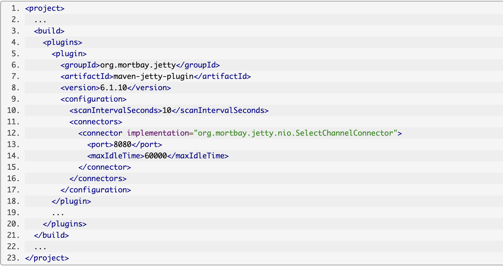
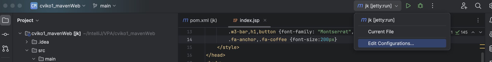
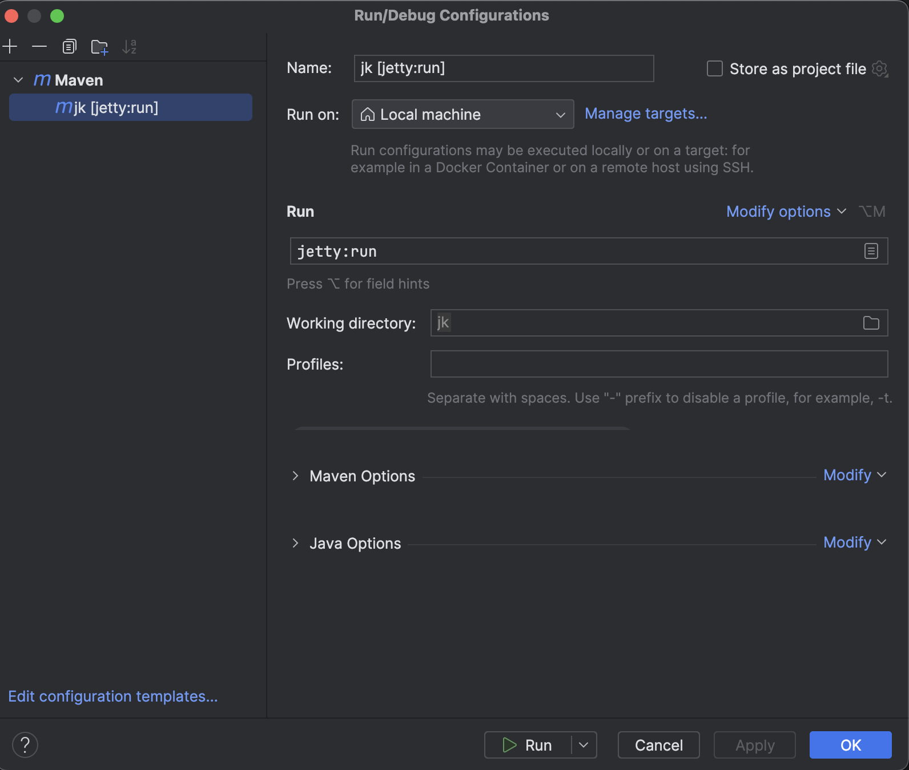

# Using jetty in webapp

Rapid Testing Using the Jetty Plugin
Normally, testing a web application involves compiling Java sources, creating a WAR and deploying it to a web container.

Using the Jetty Plugin enables you to quickly test your web application by skipping the last two steps. By default the Jetty Plugin scans target/classes for any changes in your Java sources and src/main/webapp for changes to your web sources. The Jetty Plugin will automatically reload the modified classes and web sources.

To use the Jetty Plugin just add the following in your pom.xml:

# Using jetty in webapp in IntellJ IDEA

Click on **Currnet File** in the menu and select **Edit configuration**. Once opened, click on the plus button or add a configuration. Select **Maven** in the menu and write the basic configuration before it needs to be **defined in the POM directory** according to the example.

**More information about Jetty:** [Maven Jetty information1 ](https://cwiki.apache.org/confluence/display/WICKET/Maven+Jetty+plugin)
**More information about Jetty:** [Maven Jetty information2 ](https://maven.apache.org/plugins/maven-war-plugin/examples/rapid-testing-jetty6-plugin.html)

# helpful links with more information

[Maven lifecycle ](https://maven.apache.org/guides/introduction/introduction-to-the-lifecycle.html)

[Maven plugins ](https://maven.apache.org/guides/mini/guide-configuring-plugins.html)

[Maven archotypes ](https://maven.apache.org/guides/introduction/introduction-to-archetypes.html)

[Maven repositories ](https://maven.apache.org/guides/introduction/introduction-to-repositories.html)

[Maven tutorials ](https://cguntur.me/2020/05/20/understanding-apache-maven-the-series/)

